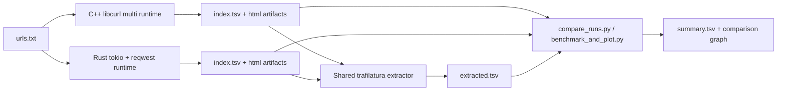
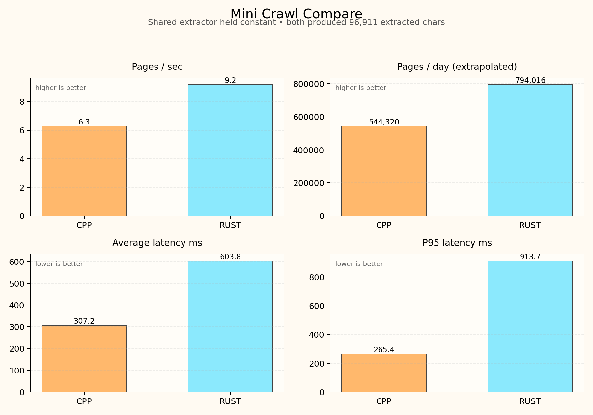

# Stashy

Stashy is a compact web-crawling systems project for learning and benchmarking the runtime side of crawling rather than reinventing extraction.

The core idea is simple:

- implement the same crawl contract in **C++** and **Rust**
- hold extraction constant with a shared Python extractor
- compare throughput, latency, and output quality on the same URL set

The current repository contains two layers:

- `mini_crawl_compare/`: the minimal side-by-side benchmark project
- `python/`, `db/`, and the legacy `cpp/` worker: the earlier queue-backed prototype kept as reference material

This lets the project stay explainable in a short demo while still preserving the deeper prototype work.

## What It Does

Given a small text file of URLs, Stashy:

- fetches the same URLs with a **C++ `libcurl` multi** runtime
- fetches the same URLs with a **Rust `tokio` + `reqwest`** runtime
- writes matching crawl artifacts for both implementations
- runs the exact same downstream extractor on both outputs
- produces a side-by-side benchmark summary and graph

The system is intentionally constrained. It does not try to out-feature mature scraping frameworks. Instead, it isolates a narrower question:

**How much performance and runtime simplicity can we get from two small implementations that do the same crawl job?**

## Approach

### Pipeline

```text
urls.txt
   -> C++ runtime
   -> index.tsv + html/
   -> shared extractor
   -> extracted.tsv
   -> benchmark summary

urls.txt
   -> Rust runtime
   -> index.tsv + html/
   -> shared extractor
   -> extracted.tsv
   -> benchmark summary
```

### Architecture


```mermaid
flowchart LR
  A["urls.txt"] --> B["C++ libcurl multi runtime"]
  A --> C["Rust tokio + reqwest runtime"]
  B --> D["index.tsv + html artifacts"]
  C --> E["index.tsv + html artifacts"]
  D --> F["Shared trafilatura extractor"]
  E --> F
  F --> G["extracted.tsv"]
  D --> H["compare_runs.py / benchmark_and_plot.py"]
  E --> H
  G --> H
  H --> I["summary.tsv + comparison graph"]
```

### Design Goals

- Keep the project small enough to explain in a 10-minute video.
- Compare runtimes, not extraction heuristics.
- Make the benchmark contract obvious and inspectable.
- Keep the source files short enough to delete and reimplement while learning.
- Preserve enough comments and hints to make the rewrite educational.

## Why This Exists

Most open-source crawling projects compete on features:

- browser automation
- anti-bot tactics
- extraction quality
- workflow ergonomics

Stashy takes a narrower angle. It treats extraction as a fixed dependency and focuses on:

- async I/O structure
- concurrency control
- artifact contracts
- latency and throughput measurement
- apples-to-apples systems comparison

That makes it a better learning project for C++, Rust, and performance engineering than a full-featured scraper clone.

## Performance Engineering Lens

This repository is deliberately shaped around topics that show up in advanced performance engineering courses.

### Concurrency and parallelism

The current implementations already exercise:

- concurrent in-flight HTTP requests
- event-driven network progress instead of one blocking request per page
- bounded concurrency via an explicit limit rather than unbounded fan-out
- a shared artifact contract so work can be pipelined cleanly across stages

In practice, the first big lesson is that throughput comes from keeping sockets, parser work, disk writes, and extraction stages overlapped without letting any one stage explode in memory or tail latency.

### Hardware exploitation

The code is still intentionally small, but the optimization path is clear:

- reuse connections aggressively
- use HTTP/2 multiplexing where possible
- avoid unnecessary copies of response bodies
- keep hot metadata compact and cache-friendly
- reduce allocator churn from per-request dynamic objects
- move toward per-core work queues instead of one shared queue
- batch file writes and summary updates to reduce syscall overhead

The real goal is not "make the code look low-level." The goal is to turn cycles into useful pages with as little runtime waste as possible.

### Memory behavior

The current project teaches a few useful memory lessons even before deep tuning:

- response bodies dominate memory pressure more than job metadata
- bounded concurrency is also a memory-control mechanism
- artifact boundaries keep long-lived state small and make lifetimes obvious
- shared extraction as a separate stage avoids keeping too much parsed state live at once

If you keep scaling the project up, the next step is to think about:

- arena or slab allocation for request metadata
- buffer reuse for response bodies
- queue sharding to reduce allocator contention
- NUMA-aware placement once the workload is large enough to span sockets

### Squeezing more out of the machine

If the goal becomes "squeeze every drop out of the clock cycles," the roadmap is:

1. replace live-web-only timing with replayable local traces so the network does not dominate the benchmark
2. use profiler data to classify the workload: front-end bound, bad speculation, memory bound, or backend bound
3. reduce tail latency before chasing peak throughput
4. optimize the hottest stage first, not the most interesting one
5. only add complexity when the measurements justify it

That discipline is more important than any individual micro-optimization.

## Course Mapping

This project lines up naturally with the themes of a performance engineering course:

- **Principles and pitfalls / reproducibility**
  The benchmark should be rerunnable from one script with a fixed URL corpus, fixed concurrency, and fixed extraction path.
- **Methodology you can trust**
  Compare the two runtimes on the same workload, over multiple trials, with stable output formats and no hidden algorithm changes.
- **Top-down microarchitectural analysis**
  Once the benchmark is replay-based, the runtimes can be classified as front-end limited, memory limited, or backend limited.
- **Memory hierarchy and NUMA**
  The next scale-up question is how queue layout, response buffering, and per-core sharding affect locality.
- **Amdahl, Gustafson, Roofline, Little's Law**
  The crawler is a good teaching example because concurrency, service time, queue depth, and throughput are easy to relate.
- **Causal profiling**
  A crawl pipeline has obvious competing bottlenecks, so it is a good candidate for "what actually counts" style optimization.
- **Allocators and fragmentation**
  Many small per-request allocations plus large response buffers create a realistic allocator story.
- **Synchronization**
  The moment the system grows beyond one shared queue, scalable synchronization becomes a first-class design choice.
- **Tail latency**
  Slow hosts and outlier pages dominate p95 and p99 behavior long before average latency looks bad.
- **Python performance**
  The shared extractor gives a clean place to study Python cost separately from the crawl runtime.
- **Benchmarking the right way**
  The project is small enough that it is tempting to overclaim from one run, which makes it a good place to practice benchmark discipline.

## What We Would Optimize Next

If the goal were to turn this into a more serious runtime benchmark, the next practical systems steps would be:

- replace the public URL set with a replayable local benchmark corpus
- separate DNS, connect, transfer, and write times
- add multiple trial runs with confidence intervals
- pin workers or shard queues by core
- reuse response buffers or move to pooled allocators
- switch from one global output path to batched or per-thread writers
- add host-aware scheduling so one slow domain does not dominate the tail

## GPU Theorycraft

This repository does **not** use GPUs today, and for the current scale that is the right choice.

Still, if you want to theory-craft GPU-oriented extensions, the most plausible ones are:

- batched content classification for `needs_browser` or page-type prediction
- batched embedding or dedup stages downstream of fetching
- SIMD- and GPU-assisted tokenization or boilerplate detection for very large offline corpora
- GPU-accelerated compression, decompression, or ranking in a much larger indexing pipeline

The least convincing GPU story would be "put HTTP fetching on the GPU." That is almost never the right bottleneck. The better story is:

- keep networking and scheduling CPU-side
- batch the expensive learned stages
- use GPUs only where there is enough parallel, regular work to amortize transfer overhead

So the honest GPU answer for this project is:

- not useful for the tiny benchmark
- plausible for a future large-scale render-gating classifier, dedup model, or embedding stage
- worth discussing as a downstream systems extension, not as the current core

## Current Benchmark Snapshot

The sample benchmark report generated from `mini_crawl_compare/report/summary.tsv` currently shows:

- C++: `6.30` pages/sec, `378.0` pages/min, `544,320` pages/day extrapolated
- Rust: `9.19` pages/sec, `551.4` pages/min, `794,016` pages/day extrapolated
- Both: `10/10` pages fetched, `564,197` HTML bytes downloaded, `96,911` extracted chars

These are **small live-web sample numbers**, not production claims. Their value is comparative:

- same input set
- same extractor
- same artifact format
- different runtimes



## Repository Layout

The repository is intentionally split by responsibility:

```text
.
├── README.md
├── mini_crawl_compare/
│   ├── README.md                  # tiny benchmark project walkthrough
│   ├── urls.txt                   # sample URL corpus
│   ├── extract_batch.py           # shared extractor
│   ├── compare_runs.py            # simple result summarizer
│   ├── benchmark_and_plot.py      # rerun + report generation
│   ├── cpp/
│   │   └── crawl.cpp              # one-file C++ crawl runtime
│   ├── rust/
│   │   ├── Cargo.toml
│   │   └── src/main.rs            # one-file Rust crawl runtime
│   └── report/
│       ├── comparison.png         # generated graph
│       └── summary.tsv            # generated benchmark summary
├── python/
│   └── stashy/                    # earlier queue-backed prototype
├── db/
│   └── init.sql                   # prototype schema and queue functions
├── cpp/
│   └── src/                       # earlier threaded fetcher prototype
├── docker-compose.yml
└── llm.text
```

## Setup

### 1. Python extractor

```bash
cd mini_crawl_compare
python3 -m venv .venv
source .venv/bin/activate
pip install -r requirements.txt
```

### 2. C++ build

This version uses the system `libcurl`.

```bash
cd mini_crawl_compare
clang++ -std=c++20 -O3 cpp/crawl.cpp $(curl-config --cflags --libs) -o cpp/crawl_cpp
```

### 3. Rust build

Install Rust locally, then:

```bash
cd mini_crawl_compare/rust
cargo build --release
```

## Running The Project

### C++

```bash
cd mini_crawl_compare
./cpp/crawl_cpp urls.txt runs/cpp 8
```

### Rust

```bash
cd mini_crawl_compare/rust
cargo run --release -- ../urls.txt ../runs/rust 8
```

### Shared extraction

```bash
cd mini_crawl_compare
source .venv/bin/activate
python extract_batch.py runs/cpp
python extract_batch.py runs/rust
```

### Benchmark summary

```bash
cd mini_crawl_compare
python compare_runs.py runs/cpp runs/rust
```

### Regenerate the graph

```bash
cd mini_crawl_compare
python benchmark_and_plot.py
```

## Code Structure Notes

The minimal benchmark is organized around a few hard boundaries:

- the C++ runtime only fetches and writes artifacts
- the Rust runtime only fetches and writes artifacts
- the Python extractor is shared across both
- the reporting scripts only summarize measured output

That separation is deliberate. It keeps the project honest and makes it easy to reason about what changed between runs.

## Legacy Prototype

The older prototype remains in the repository because it still demonstrates useful systems ideas:

- PostgreSQL `FOR UPDATE SKIP LOCKED` queue claiming
- retry semantics and worker metrics
- frontier scoring for geospatial pages
- a deterministic simulation benchmark for policy comparison

Those components are no longer the main entry point for the repo, but they are still useful reference material if you want to evolve the project back toward a richer crawl system.

## Known Limitations

- The current benchmark uses a tiny public URL set, so live-web noise is significant.
- The project is intentionally not feature-complete.
- There is no browser fallback lane yet.
- Throughput numbers depend heavily on remote site latency and rate limits.
- The C++ and Rust runtimes are kept simple on purpose, so they are not fully tuned production crawlers.

## Future Improvements

- Add a local replay benchmark to reduce internet noise.
- Add a lightweight `needs_browser` gate for selective rendering.
- Add per-host scheduling and politeness controls.
- Add `perf` or flamegraph-based profiling notes.
- Expand the benchmark corpus into static, docs-heavy, and JS-heavy buckets.
